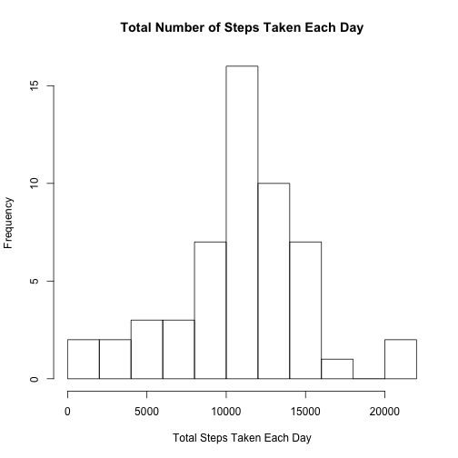
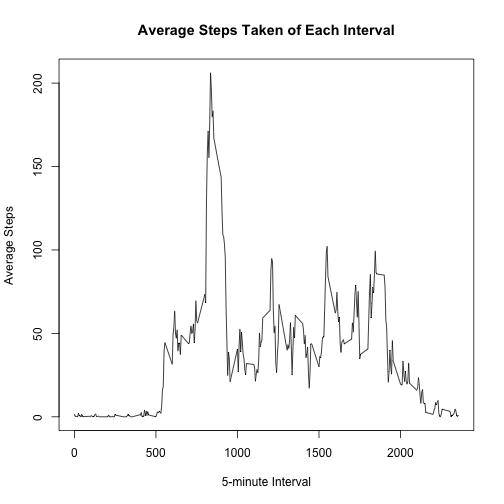
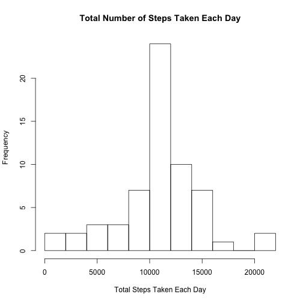
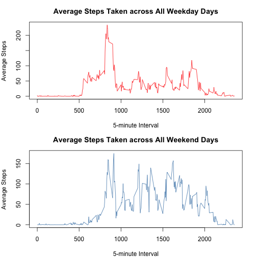

This is an R Markdown document. Markdown is a simple formatting syntax for authoring HTML, PDF, and MS Word documents. For more details on using R Markdown see <http://rmarkdown.rstudio.com>.

When you click the **Knit** button a document will be generated that includes both content as well as the output of any embedded R code chunks within the document. You can embed an R code chunk like this:


I. Loading and preprocessing the data
1. Load the data (i.e. read.csv())

```r
setwd('/Users/ouakira/Dropbox/Learning and Job/Coursera/Data Science/5. Reproducible Research/Assignment')
dat = read.csv('activity.csv',header=T,stringsAsFactors=F)
```

2. Process/transform the data (if necessary) into a format suitable for your analysis
Not necessary. Skipped. 

II. What is mean total number of steps taken per day?
(For this part of the assignment, you can ignore the missing values in the dataset.)

1. Calculate the total number of steps taken per day

```r
steps <- tapply(dat$steps,dat$date,sum)
steps_per_day <- data.frame(date=names(steps),totalSteps=steps)
print(steps_per_day)
```

```
##                  date totalSteps
## 2012-10-01 2012-10-01         NA
## 2012-10-02 2012-10-02        126
## 2012-10-03 2012-10-03      11352
## 2012-10-04 2012-10-04      12116
## 2012-10-05 2012-10-05      13294
## 2012-10-06 2012-10-06      15420
## 2012-10-07 2012-10-07      11015
## 2012-10-08 2012-10-08         NA
## 2012-10-09 2012-10-09      12811
## 2012-10-10 2012-10-10       9900
## 2012-10-11 2012-10-11      10304
## 2012-10-12 2012-10-12      17382
## 2012-10-13 2012-10-13      12426
## 2012-10-14 2012-10-14      15098
## 2012-10-15 2012-10-15      10139
## 2012-10-16 2012-10-16      15084
## 2012-10-17 2012-10-17      13452
## 2012-10-18 2012-10-18      10056
## 2012-10-19 2012-10-19      11829
## 2012-10-20 2012-10-20      10395
## 2012-10-21 2012-10-21       8821
## 2012-10-22 2012-10-22      13460
## 2012-10-23 2012-10-23       8918
## 2012-10-24 2012-10-24       8355
## 2012-10-25 2012-10-25       2492
## 2012-10-26 2012-10-26       6778
## 2012-10-27 2012-10-27      10119
## 2012-10-28 2012-10-28      11458
## 2012-10-29 2012-10-29       5018
## 2012-10-30 2012-10-30       9819
## 2012-10-31 2012-10-31      15414
## 2012-11-01 2012-11-01         NA
## 2012-11-02 2012-11-02      10600
## 2012-11-03 2012-11-03      10571
## 2012-11-04 2012-11-04         NA
## 2012-11-05 2012-11-05      10439
## 2012-11-06 2012-11-06       8334
## 2012-11-07 2012-11-07      12883
## 2012-11-08 2012-11-08       3219
## 2012-11-09 2012-11-09         NA
## 2012-11-10 2012-11-10         NA
## 2012-11-11 2012-11-11      12608
## 2012-11-12 2012-11-12      10765
## 2012-11-13 2012-11-13       7336
## 2012-11-14 2012-11-14         NA
## 2012-11-15 2012-11-15         41
## 2012-11-16 2012-11-16       5441
## 2012-11-17 2012-11-17      14339
## 2012-11-18 2012-11-18      15110
## 2012-11-19 2012-11-19       8841
## 2012-11-20 2012-11-20       4472
## 2012-11-21 2012-11-21      12787
## 2012-11-22 2012-11-22      20427
## 2012-11-23 2012-11-23      21194
## 2012-11-24 2012-11-24      14478
## 2012-11-25 2012-11-25      11834
## 2012-11-26 2012-11-26      11162
## 2012-11-27 2012-11-27      13646
## 2012-11-28 2012-11-28      10183
## 2012-11-29 2012-11-29       7047
## 2012-11-30 2012-11-30         NA
```

2. If you do not understand the difference between a histogram and a barplot, research the difference between them. Make a histogram of the total number of steps taken each day

```r
hist(steps_per_day$totalSteps, breaks=10, 
     main = "Total Number of Steps Taken Each Day", xlab = 'Total Steps Taken Each Day')
```

 

3. Calculate and report the mean and median of the total number of steps taken per day

```r
# Mean of the total number of steps taken per day
mean(steps_per_day$totalSteps, na.rm=T)
```

```
## [1] 10766.19
```

```r
# Median of the total number of steps taken per day
median(steps_per_day$totalSteps, na.rm=T)
```

```
## [1] 10765
```

III. What is the average daily activity pattern?

1. Make a time series plot (i.e. type = "l") of the 5-minute interval (x-axis) and the average number of steps taken, averaged across all days (y-axis)

```r
avg_steps_per_interval <- aggregate(steps~interval,dat,mean,na.rm=T)
plot(steps~interval, data=avg_steps_per_interval, type='l',
     main = "Average Steps Taken of Each Interval", xlab = '5-minute Interval',ylab='Average Steps')
```

 

2. Which 5-minute interval, on average across all the days in the dataset, contains the maximum number of steps?

```r
max_steps = max(avg_steps_per_interval$steps)
max_interval = avg_steps_per_interval[avg_steps_per_interval$steps==max_steps,'interval']
cat('On average across all the days, the maximum number of steps is ', max_steps, ', which is contained by 5-minute interval ', max_interval,'.', sep = "")
```

```
## On average across all the days, the maximum number of steps is 206.1698, which is contained by 5-minute interval 835.
```

IV. Imputing missing values
Note that there are a number of days/intervals where there are missing values (coded as NA). The presence of missing days may introduce bias into some calculations or summaries of the data.

1. Calculate and report the total number of missing values in the dataset (i.e. the total number of rows with NAs)

```r
nrow(dat[apply(is.na(dat),1,sum)>0,])
```

```
## [1] 2304
```

2. Devise a strategy for filling in all of the missing values in the dataset. The strategy does not need to be sophisticated. For example, you could use the mean/median for that day, or the mean for that 5-minute interval, etc.

```r
# will use mean steps per interval to impute the missing values. 
names(avg_steps_per_interval)[2] = 'meanSteps'
```

3. Create a new dataset that is equal to the original dataset but with the missing data filled in.

```r
dat_imputed = dat
merged = merge(dat_imputed, avg_steps_per_interval)
merged = merged[order(merged$date,merged$interval),]
dat_imputed$steps <- ifelse(is.na(dat_imputed$steps), merged$meanSteps, dat_imputed$steps)
```

4. Make a histogram of the total number of steps taken each day and Calculate and report the mean and median total number of steps taken per day. Do these values differ from the estimates from the first part of the assignment? What is the impact of imputing missing data on the estimates of the total daily number of steps?

```r
total_steps_per_day <- aggregate(steps~date,dat_imputed,sum,na.rm=T)
hist(total_steps_per_day$steps, breaks=10, 
     main = "Total Number of Steps Taken Each Day", xlab = 'Total Steps Taken Each Day')
```

 

```r
# Mean of the total number of steps taken per day
mean(total_steps_per_day$steps, na.rm=T)
```

```
## [1] 10766.19
```

```r
# Median of the total number of steps taken per day
median(total_steps_per_day$steps, na.rm=T)
```

```
## [1] 10766.19
```
A: Yes. These values do not differ from the estimates from the first part of the assignment. 
A: The impart of imputing is slight. The shape are basically the same as before. 


V. Are there differences in activity patterns between weekdays and weekends?
(For this part the weekdays() function may be of some help here. Use the dataset with the filled-in missing values for this part.)

1. Create a new factor variable in the dataset with two levels – “weekday” and “weekend” indicating whether a given date is a weekday or weekend day.

```r
dat$week_day = weekdays(as.Date(dat$date))
dat$week_day <- as.factor(ifelse(dat$week_day%in%c("Saturday","Sunday"),'weekend','weekday'))
```

2. Make a panel plot containing a time series plot (i.e. type = "l") of the 5-minute interval (x-axis) and the average number of steps taken, averaged across all weekday days or weekend days (y-axis). See the README file in the GitHub repository to see an example of what this plot should look like using simulated data.

```r
avg_steps <- aggregate(steps~week_day+interval,dat,mean,na.rm=T)
par(mfrow=c(2,1), mar=c(4,4,3,2))
plot(steps~interval, data=avg_steps[avg_steps$week_day=='weekday',], type='l',col='red',
     main = "Average Steps Taken across All Weekday Days", xlab = '5-minute Interval',ylab='Average Steps')
plot(steps~interval, data=avg_steps[avg_steps$week_day=='weekend',], type='l',col='steelblue',
     main = "Average Steps Taken across All Weekend Days", xlab = '5-minute Interval',ylab='Average Steps')
```

 


end. 
